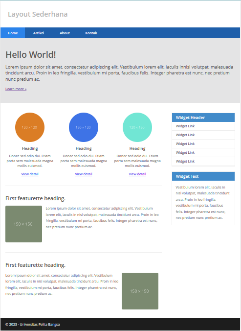
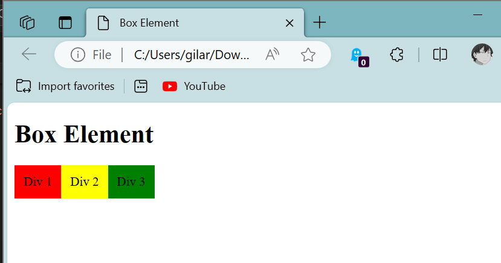
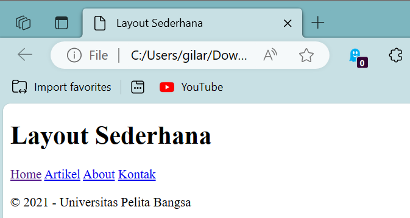
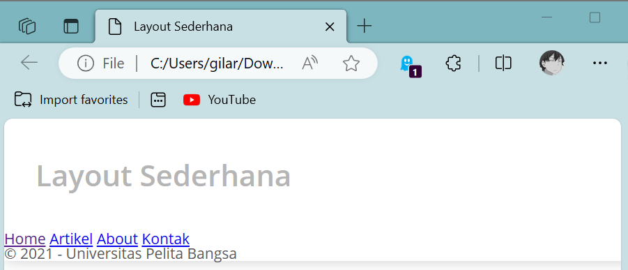
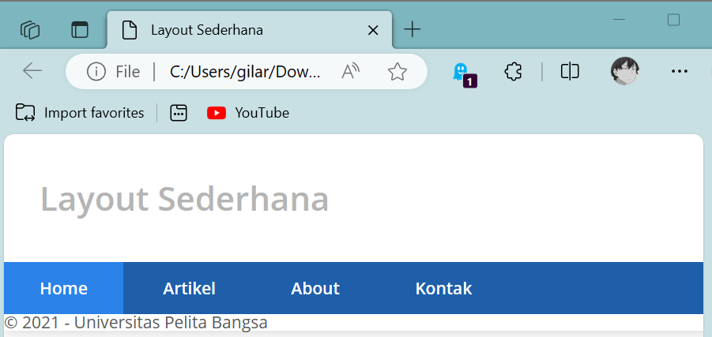
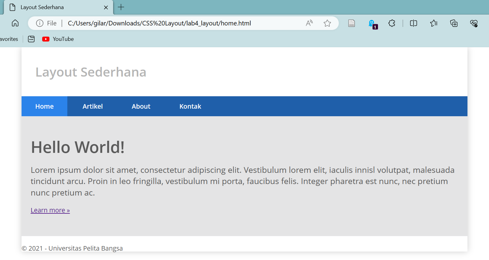
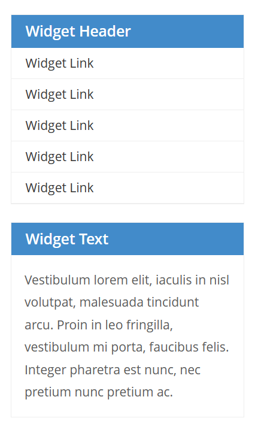
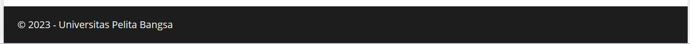
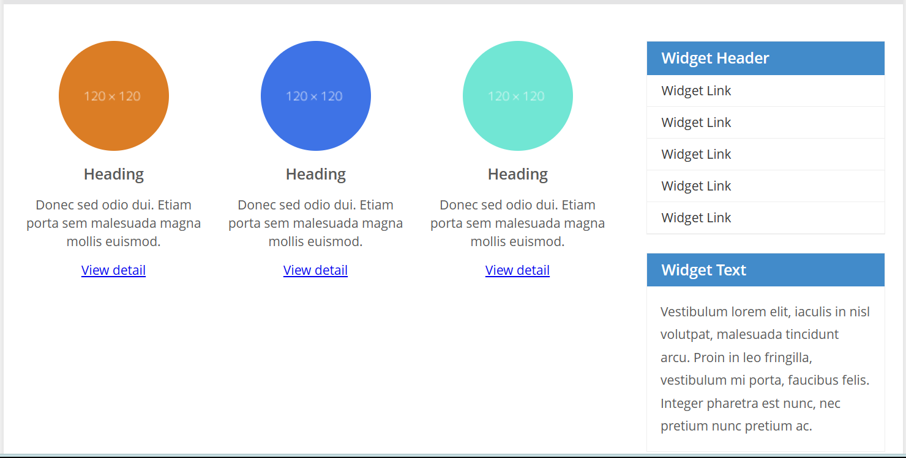
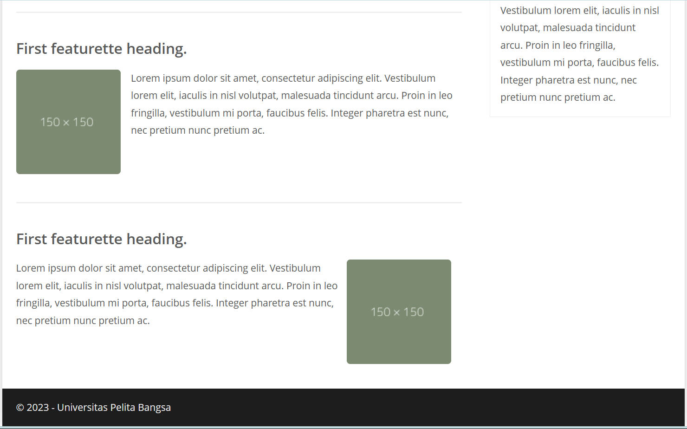

# CSS Layout
## Profil
| Variable | Isi |
| -------- | --- |
| **Nama** | Gilar Sumilar |
| **NIM** | 312210407 |
| **Kelas** | TI.22.A4 |
| **Mata Kuliah** | Pemrograman WEB |

### Tugas
1. Buatlah repository baru dengan nama Lab4Web.
2. Kerjakan semua latihan yang diberikan sesuai urutannya.
3. Screenshot setiap perubahannya.
4. Buatlah file README.md dan tuliskan penjelasan dari setiap langkah praktikum beserta
screenshotnya.
5. Commit hasilnya pada repository masing-masing.
6. Kirim URL repository pada e-learning ecampus.

### Pertanyaan dan Tugas
1. Tambahkan Layout untuk menu About.
=> buat single layout yang berisi deskripsi, portfolio, dll.
2. Tambahkan layout untuk menu Contact
=> yang berisi form isian: nama, email, message, dll.

### Jawaban
[Sourcecode](https://github.com/GilarSumilar/Lab4Web/tree/main/lab4_layout)

**Hasil tugas :**

 

# Penjelasan 
## 1. 
```HTML
<!DOCTYPE html>
<html lang="en">

<head>
    <meta charset="UTF-8">
    <meta name="viewport" content="width=device-width, initial-scale=1.0">
    <title>Box Element</title>
    <style>
        div {
            float: left;
            padding: 10px;
        }

        .div1 {
            background: red;
        }

        .div2 {
            background: yellow;
        }

        .div3 {
            background: green;
        }
    </style>
</head>

<body>
    <header>
        <h1>Box Element</h1>
    </header>
    <section>
        <div class="div1">Div 1</div>
        <div class="div2">Div 2</div>
        <div class="div3">Div 3</div>
    </section>
</body>

</html>
```
**Hasil :**



#### *Note :*
- Membuat Box Element
  
#### Kemudian tambahkan kode untuk membuat box element dengan tag div seperti berikut.
```HTML
<section>
<div class="div1">Div 1</div>
<div class="div2">Div 2</div>
<div class="div3">Div 3</div>
</section>
```
- CSS Float Property
  
Selanjutnya tambahkan deklarasi CSS pada head untuk membuat float element, seperti berikut.
```CSS
<style>
div {
float:left;
padding: 10px;
}
.div1 {
background: red;
}
.div2 {
background: yellow;
}
.div3 {
background: green;
}
</style>
```

## 2. Mengatur Clearfix Element
- Mengatur Clearfix Element
  
Clearfix digunakan untuk mengatur element setelah float element. Property clear digunakan untuk
mengaturnya.
Tambahkan element div lainnya seteleah div3 seperti berikut.
```HTML
<section>
<div class="div1">Div 1</div>
<div class="div2">Div 2</div>
<div class="div3">Div 3</div>
<div class="div4">Div 4</div>
</section>
```
#### Kemudian atur property clear pada CSS, seperti berikut.
```CSS
.div4 {
background-color: blue;
clear: left;
float: none;
}
```
#### *Note :*
Kalau di gabungkan akan menjadi seperti ini.

```HTML
    <!DOCTYPE html>
    <html lang="en">

    <head>
        <meta charset="UTF-8">
        <meta name="viewport" content="width=device-width, initial-scale=1.0">
        <title>Box Element</title>
        <style>
            div {
                float: left;
                padding: 10px;
            }

            .div1 {
                background: red;
            }

            .div2 {
                background: yellow;
            }

            .div3 {
                background: green;
            }
            
            .div4 {
            background-color: blue;
            clear: left;
            float: none;
            }
        </style>
    </head>

    <body>
        <header>
            <h1>Box Element</h1>
        </header>
        <section>
            <div class="div1">Div 1</div>
            <div class="div2">Div 2</div>
            <div class="div3">Div 3</div>
            <div class="div4">Div 4</div>
        </section>
    </body>

    </html>
```

## 3. Membuat Layout Sederhana 
Buat folder baru dengan nama lab4_layout, kemudian buatlah file baru didalamnya dengan nama
home.html, dan file css dengan nama style.css.

```HTML
<!DOCTYPE html>
<html lang="en">

<head>
    <meta charset="UTF-8">
    <meta name="viewport" content="width=device-width, initial-scale=1.0">
    <title>Layout Sederhana</title>
    <link rel="stylesheet" href="style.css">
</head>

<body>
    <div id="container">
    </div>
    <header>
        <h1>Layout Sederhana</h1>
    </header>
    <nav>
        <a href="home.html" class="active">Home</a>
        <a href="artikel.html">Artikel</a>
        <a href="about.html">About</a>
        <a href="kontak.html">Kontak</a>
    </nav>
    <section id="hero"></section>
    <section id="wrapper">
        <section id="main"></section>
        <aside id="sidebar"></aside>
    </section>
    <footer>
        <p>&copy; 2021 - Universitas Pelita Bangsa</p>
    </footer>
</body>

</html>
```
**Hasil :**



#### *Note :*
`aside` adalah sebuah elemen HTML yang digunakan untuk menyajikan konten sampingan atau konten yang berkaitan dengan konten utama halaman, 
tetapi tidak begitu penting sehingga dapat dipisahkan dari konten utama. 
Elemen "aside" biasanya digunakan untuk menampilkan informasi tambahan yang dapat berupa 
sidebar, iklan, catatan kaki, atau hal-hal lain yang mendukung konten utama.

#### Kemudian tambahkan kode CSS untuk membuat layoutnya.
```CSS
/* import google font */
@import url('https://fonts.googleapis.com/css2?family=Open+Sans:ital,wght@0,300;0,400; 0, 600; 0, 700; 0, 800; 1, 300; 1, 400; 1, 600; 1, 700; 1, 800&display=swap');
@import url('https://fonts.googleapis.com/css2?family=Open+Sans+Condensed:ital,wght@0, 300; 0, 700; 1, 300&display=swap');

/* Reset CSS */
* {
    margin: 0;
    padding: 0;
}

body {
    line-height: 1;
    font-size: 100%;
    font-family: 'Open Sans', sans-serif;
    color: #5a5a5a;
}

#container {
    width: 980px;
    margin: 0 auto;
    box-shadow: 0 0 1em #cccccc;
}

/* header */
header {
    padding: 20px;
}

header h1 {
    margin: 20px 10px;
    color: #b5b5b5;
}
```
**Hasil :**



#### *Note :*
- Jangan lupa tambahkan `link` seperti ini pada HTML anda.
  
`<link rel="stylesheet" href="style.css">` 

## 4. Membuat Navigasi
```CSS
/* navigasi */
nav {
    display: block;
    background-color: #1f5faa;
}

nav a {
    padding: 15px 30px;
    display: inline-block;
    color: #ffffff;
    font-size: 14px;
    text-decoration: none;
    font-weight: bold;
}

nav a.active,
nav a:hover {
    background-color: #2b83ea;
}
```
**Hasil :**



#### *Note :*
Menu Navigasi: 

Menu adalah daftar tautan atau opsi yang membantu pengguna menuju ke halaman atau bagian yang berbeda dalam situs web. 
Ini sering terdapat di bagian atas atau samping situs web


## 5. Membuat Hero Panel

### Hasil Full HTML
```HTML
<!DOCTYPE html>
<html lang="en">

<head>
    <meta charset="UTF-8">
    <meta name="viewport" content="width=device-width, initial-scale=1.0">
    <title>Layout Sederhana</title>
    <link rel="stylesheet" href="P2.css">
</head>

<body>
    <div id="container">
    </div>
    <header>
        <h1>Layout Sederhana</h1>
    </header>
    <nav>
        <a href="home.html" class="active">Home</a>
        <a href="artikel.html">Artikel</a>
        <a href="about.html">About</a>
        <a href="kontak.html">Kontak</a>
    </nav>
    <section id="hero">
        <h1>Hello World!</h1>
        <p>Lorem ipsum dolor sit amet, consectetur adipiscing elit. Vestibulum lorem
            elit, iaculis innisl volutpat, malesuada tincidunt arcu. Proin in leo fringilla,
            vestibulum mi porta, faucibus felis. Integer pharetra est nunc, nec pretium nunc
            pretium ac.</p>
        <a href="home.html" class="btn btn-large">Learn more &raquo;</a>
    </section>
    <section id="wrapper">
        <section id="main"></section>
        <aside id="sidebar"></aside>
    </section>
    <footer>
        <p>&copy; 2021 - Universitas Pelita Bangsa</p>
    </footer>
</body>

</html>
```

#### Tambahkan syntax ini setelah navigasi pada file ccs
```CSS
/* Hero Panel */
#hero {
    background-color: #e4e4e5;
    padding: 50px 20px;
    margin-bottom: 20px;
}

#hero h1 {
    margin-bottom: 20px;
    font-size: 35px;
}

#hero p {
    margin-bottom: 20px;
    font-size: 18px;
    line-height: 25px;
}
```
**Hasil :**



#### *Note :*
Ubah syntax `section` seperti ini.
```HTML
<section id="hero">
<h1>Hello World!</h1>
<p>Lorem ipsum dolor sit amet, consectetur adipiscing elit. Vestibulum lorem
elit, iaculis innisl volutpat, malesuada tincidunt arcu. Proin in leo fringilla,
vestibulum mi porta, faucibus felis. Integer pharetra est nunc, nec pretium nunc
pretium ac.</p>
<a href="home.html" class="btn btn-large">Learn more &raquo;</a>
</section>
```
tag `<section>` digunakan untuk mengelompokkan konten ke dalam sebuah bagian atau seksi tertentu dalam dokumen HTML.

## 6. Mengatur Layout Main dan Sidebar
Selanjutnya mengatur main content dan sidebar, tambahkan CSS float.

#### Hasil FULL HTML
```HTML
<!DOCTYPE html>
<html lang="en">

<head>
    <meta charset="UTF-8">
    <meta name="viewport" content="width=device-width, initial-scale=1.0">
    <title>Layout Sederhana</title>
    <link rel="stylesheet" href="P2.css">
</head>

<body>
    <div id="container">
    </div>
    <header>
        <h1>Layout Sederhana</h1>
    </header>
    <nav>
        <a href="home.html" class="active">Home</a>
        <a href="artikel.html">Artikel</a>
        <a href="about.html">About</a>
        <a href="kontak.html">Kontak</a>
    </nav>
    <section id="hero">
        <h1>Hello World!</h1>
        <p>Lorem ipsum dolor sit amet, consectetur adipiscing elit. Vestibulum lorem
            elit, iaculis innisl volutpat, malesuada tincidunt arcu. Proin in leo fringilla,
            vestibulum mi porta, faucibus felis. Integer pharetra est nunc, nec pretium nunc
            pretium ac.</p>
        <a href="home.html" class="btn btn-large">Learn more &raquo;</a>
    </section>
    <section id="wrapper">
        <section id="main"></section>
        <aside id="sidebar">
            <div class="widget-box">
                <h3 class="title">Widget Header</h3>
                <ul>
                    <li><a href="#">Widget Link</a></li>
                    <li><a href="#">Widget Link</a></li>
                    <li><a href="#">Widget Link</a></li>
                    <li><a href="#">Widget Link</a></li>
                    <li><a href="#">Widget Link</a></li>
                </ul>
            </div>
            <div class="widget-box">
                <h3 class="title">Widget Text</h3>
                <p>Vestibulum lorem elit, iaculis in nisl volutpat, malesuada tincidunt
                    arcu. Proin in leo fringilla, vestibulum mi porta, faucibus felis. Integer
                    pharetra est nunc, nec pretium nunc pretium ac.</p>
            </div>
        </aside>
        </section>
    </section>
    <footer>
        <p>&copy; 2021 - Universitas Pelita Bangsa</p>
    </footer>
</body>

</html>
```

#### Tambahkan syntax ini setelah Hero panel pada CSS
```CSS
/* main content */
#wrapper {
    margin: 0;
}

#main {
    float: left;
    width: 640px;
    padding: 20px;
}

/* sidebar area */
#sidebar {
    float: left;
    width: 260px;
    padding: 20px;
}

/* widget */
.widget-box {
    border: 1px solid #eee;
    margin-bottom: 20px;
}

.widget-box .title {
    padding: 10px 16px;
    background-color: #428bca;
    color: #fff;
}

.widget-box ul {
    list-style-type: none;
}

.widget-box li {
    border-bottom: 1px solid #eee;
}

.widget-box li a {
    padding: 10px 16px;
    color: #333;
    display: block;
    text-decoration: none;
}

.widget-box li:hover a {
    background-color: #eee;
}

.widget-box p {
    padding: 15px;
    line-height: 25px;
}
```

**Hasil :**



#### *Note :*
- Ubah syntax `aside` seperti ini.
  
```HTML
<aside id="sidebar">
<div class="widget-box">
<h3 class="title">Widget Header</h3>
<ul>
<li><a href="#">Widget Link</a></li>
<li><a href="#">Widget Link</a></li>
<li><a href="#">Widget Link</a></li>
<li><a href="#">Widget Link</a></li>
<li><a href="#">Widget Link</a></li>
</ul>
</div>
<div class="widget-box">
<h3 class="title">Widget Text</h3>
<p>Vestibulum lorem elit, iaculis in nisl volutpat, malesuada tincidunt
arcu. Proin in leo fringilla, vestibulum mi porta, faucibus felis. Integer
pharetra est nunc, nec pretium nunc pretium ac.</p>
</div>
</aside>
```
Di atas sudah di jelaskan apa itu aside.

## 7. Mengatur Footer
```CSS
/* footer */
footer {
    clear: both;
    background-color: #1d1d1d;
    padding: 20px;
    color: #eee;
}
```
**Hasil :**



#### *Note :*
"footer" adalah bagian terakhir atau bawah halaman web yang umumnya berisi informasi tambahan, 
seperti hak cipta, tautan ke halaman-halaman terkait, informasi kontak, atau tautan ke kebijakan privasi.

## 8. Menambahkan Elemen lainnya pada Main Content

#### Hasil FULL HTML.
```HTML
<!DOCTYPE html>
<html lang="en">

<head>
    <meta charset="UTF-8">
    <meta name="viewport" content="width=device-width, initial-scale=1.0">
    <title>Layout Sederhana</title>
    <link rel="stylesheet" href="P2.css">
</head>

<body>
    <div id="container">
    </div>
    <header>
        <h1>Layout Sederhana</h1>
    </header>
    <nav>
        <a href="home.html" class="active">Home</a>
        <a href="artikel.html">Artikel</a>
        <a href="about.html">About</a>
        <a href="kontak.html">Kontak</a>
    </nav>
    <section id="hero">
        <h1>Hello World!</h1>
        <p>Lorem ipsum dolor sit amet, consectetur adipiscing elit. Vestibulum lorem
            elit, iaculis innisl volutpat, malesuada tincidunt arcu. Proin in leo fringilla,
            vestibulum mi porta, faucibus felis. Integer pharetra est nunc, nec pretium nunc
            pretium ac.</p>
        <a href="home.html" class="btn btn-large">Learn more &raquo;</a>
    </section>
    <section id="wrapper">
        <section id="main">
            <div class="row">
                <div class="box">
                    
                    <h3>Heading</h3>
                    <p>Donec sed odio dui. Etiam porta sem malesuada magna mollis
                        euismod.</p>
                    <a href="#" class="btn btn-default">View detail</a>
                </div>
                <div class="box">
                    
                    <h3>Heading</h3>
                    <p>Donec sed odio dui. Etiam porta sem malesuada magna mollis
                        euismod.</p>
                    <a href="#" class="btn btn-default">View detail</a>
                </div>
                <div class="box">
                    
                    <h3>Heading</h3>
                    <p>Donec sed odio dui. Etiam porta sem malesuada magna mollis
                        euismod.</p>
                    <a href="#" class="btn btn-default">View detail</a>
                </div>
            </div>
        </section>
        <aside id="sidebar">
            <div class="widget-box">
                <h3 class="title">Widget Header</h3>
                <ul>
                    <li><a href="#">Widget Link</a></li>
                    <li><a href="#">Widget Link</a></li>
                    <li><a href="#">Widget Link</a></li>
                    <li><a href="#">Widget Link</a></li>
                    <li><a href="#">Widget Link</a></li>
                </ul>
            </div>
            <div class="widget-box">
                <h3 class="title">Widget Text</h3>
                <p>Vestibulum lorem elit, iaculis in nisl volutpat, malesuada tincidunt
                    arcu. Proin in leo fringilla, vestibulum mi porta, faucibus felis. Integer
                    pharetra est nunc, nec pretium nunc pretium ac.</p>
            </div>
        </aside>
    </section>
    </section>
    <footer>
        <p>&copy; 2021 - Universitas Pelita Bangsa</p>
    </footer>
</body>

</html>
```

#### Tambahkan syntax ini setelah Footer panel pada CSS, kalau menurut saya di atas Footer.
```CSS
/* box */
.box {
    display: block;
    float: left;
    width: 33.333333%;
    box-sizing: border-box;
    -moz-box-sizing: border-box;
    -webkit-box-sizing: border-box;
    padding: 0 10px;
    text-align: center;
}

.box h3 {
    margin: 15px 0;
}

.box p {
    line-height: 20px;
    font-size: 14px;
    margin-bottom: 15px;
}

box img {
    border: 0;
    vertical-align: middle;
}

.image-circle {
    border-radius: 50%;
}

.row {
    margin: 0 -10px;
    box-sizing: border-box;
    -moz-box-sizing: border-box;
    -webkit-box-sizing: border-box;
}

.row:after,
.row:before,
.entry:after,
.entry:before {
    content: '';
    display: table;
}

.row:after,
.entry:after {
    clear: both;
}
```
**Hasil :**



#### *Note :*
- Menambahkan sedikit detail :V
```HTML
<section id="main">
<div class="row">
<div class="box">

<h3>Heading</h3>
<p>Donec sed odio dui. Etiam porta sem malesuada magna mollis
euismod.</p>
<a href="#" class="btn btn-default">View detail</a>
</div>
<div class="box">

<h3>Heading</h3>
<p>Donec sed odio dui. Etiam porta sem malesuada magna mollis
euismod.</p>
<a href="#" class="btn btn-default">View detail</a>
</div>
<div class="box">

<h3>Heading</h3>
<p>Donec sed odio dui. Etiam porta sem malesuada magna mollis
euismod.</p>
<a href="#" class="btn btn-default">View detail</a>
</div>
</div>
</section>
```

## 9. Menambahkan Content Artikel
Selanjutnya membuat content artikel. Tambahkan HTML berikut pada main content.

#### Taruh dibawah konten `row` di dalam bungkus `main`
```HTML
<hr class="divider" />
<article class="entry">
<h2>First featurette heading.</h2>

<p>Lorem ipsum dolor sit amet, consectetur adipiscing elit. Vestibulum lorem
elit, iaculis in nisl volutpat, malesuada tincidunt arcu. Proin in leo fringilla,
vestibulum mi porta, faucibus felis. Integer pharetra est nunc, nec pretium nunc
pretium ac.</p>
</article>
<hr class="divider" />
<article class="entry">
<h2>First featurette heading.</h2>

<p>Lorem ipsum dolor sit amet, consectetur adipiscing elit. Vestibulum lorem
elit, iaculis in nisl volutpat, malesuada tincidunt arcu. Proin in leo fringilla,
vestibulum mi porta, faucibus felis. Integer pharetra est nunc, nec pretium nunc
pretium ac.</p>
</article>
```
#### Taruh syntax ini di bawah main conten
```CSS
.divider {
    border: 0;
    border-top: 1px solid #eeeeee;
    margin: 40px 0;
}

/* entry */
.entry {
    margin: 15px 0;
}

.entry h2 {
    margin-bottom: 20px;
}

.entry p {
    line-height: 25px;
}

.entry img {
    float: left;
    border-radius: 5px;
    margin-right: 15px;
}

.entry .right-img {
    float: right;
}
```
**Hasil :**



#### *Note :*


